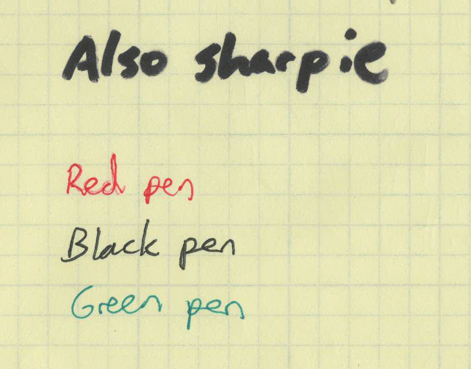
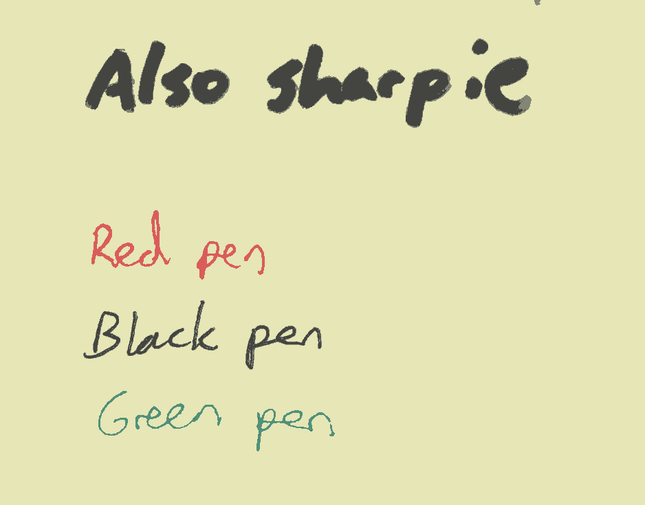

# noteshrink

Convert scans of handwritten notes to beautiful.

## Requirements

 - [stb](https://github.com/nothings/stb). Copy to `src/ext`.

## Usage

```sh
./noteshrink IMAGE_IN IMAGE_OUT.png
```

## Build

```sh
mkdir build
cd build
cmake ..
make
```

## Demo

```sh
./noteshrink images/test.jpg images/testout.png
optipng images/testout.png
```

`images/test.jpg`:  

**35113** bytes.

`images/testout.png`:  

**7281** bytes.
